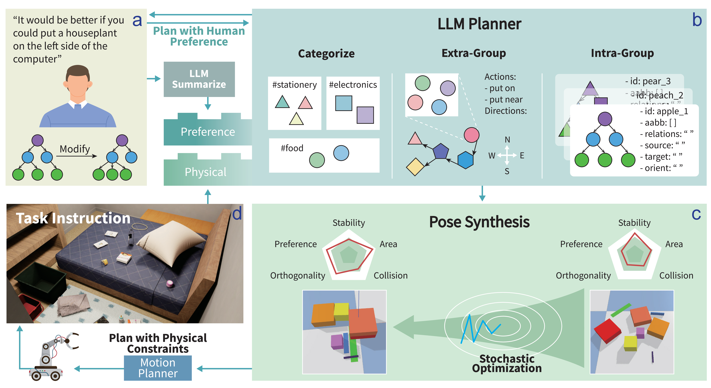
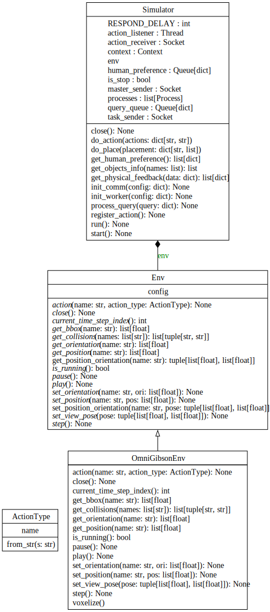

<h1 align="center">
    In-situ Value-aligned Human-Robot Interactions with Physical Constraints
</h1>

<p align="center">
    <a href="https://iclhf.github.io">
        
    </a>
    <a href="https://arxiv.org/abs/2508.07606">
        
    </a>
    <a href="https://www.python.org/downloads/release/python-31015">
        
    </a>
    <a href="https://docs.astral.sh/ruff">
        
    </a>
    <a href="https://opensource.org/licenses/MIT">
        
    </a>
</p>



# 💻 Quick Start
1. Install [OmniGibson](https://behavior.stanford.edu/omnigibson/getting_started/installation.html)
2. Install python packages according to `requirements.txt` (test on [OmniGibson Docker](https://github.com/StanfordVL/BEHAVIOR-1K/blob/main/OmniGibson/docker/run_docker.sh))
3. Set up your LLMs:
   - Define the model parameters in the `config/worker/llm_planner.yml`
   - Start your local LLM API server according to the above config
4. Run `main.py`

# 💪 Extensions
## Setup New Environments
You can extend the `Env` class and implement the corresponding abstract methods. Then, replace `self.env` with your custom class in `Simulator`.

<p align="center">
    
</p>

## Setup New Scenes
Create your custom scene based on `config/scene/messy_table.yml`.

```yaml
env: {}

render:
  viewer_width: 1280
  viewer_height: 720

camera:
  pos: [0.59532403, 0.4193147 , 1.55157923]
  ori: [0.26229059, -0.25949866, -0.6536896, 0.66072233]

scene:
  type: InteractiveTraversableScene
  scene_model: Rs_int  # select a scene from https://behavior.stanford.edu/omnigibson/modules/scenes.html

robots:
  - type: Fetch
    position: [0.25, -0.43, 0.05]
    orientation: [0, 0, 0, 1]
    obs_modalities: [rgb]
    scale: 1.0
    self_collision: false
    action_normalize: true
    action_type: continuous
    grasping_mode: sticky  # assisted
    fixed_base: True
    controller_config:
      base:
        name: DifferentialDriveController
      arm_0:
        name: JointController
        motor_type: position

objects:  # add more objects here according to https://behavior.stanford.edu/knowledgebase/objects/index.html
  - type: DatasetObject
    name: apple_1
    category: apple
    model: qrqzvs
    position: [1.71000004, 0.28999999, 0.83999997]
    orientation: [0.73711246, 0.46027726, 0.4582077, 0.18669738]
  - type: DatasetObject
    name: bottle_of_orange_juice_2
    category: bottle_of_orange_juice
    model: rtqqor
    position: [1.37, 0.25, 0.81999999]
    orientation: [0, 0, 0, 1]

supporters:  # specify supporters
  - type: DatasetObject
    name: breakfast_table_skczfi_0

actions:
  - put_on: 2
  - put_near: 2
  - put_in: 2
  - close: 1
  - open: 1
  - slice: 1
  - throw: 1
  - clean: 1
  - fold: 1
  - unfold: 1
  - heat: 1
  - freeze: 1

workers:
  master: config/worker/master.yml
  llm_planner: config/worker/llm_planner.yml
  pog_planner: config/worker/pog_planner.yml
```

# 📄 Citation

```bibtex
@misc{li2025iclhf,
    title = {In-situ Value-aligned Human-Robot Interactions with Physical Constraints},
    author = {Hongtao Li and Ziyuan Jiao and Xiaofeng Liu and Hangxin Liu and Zilong Zheng},
    journal = {arXiv preprint arXiv:2508.07606},
    year = {2025}
}
```
